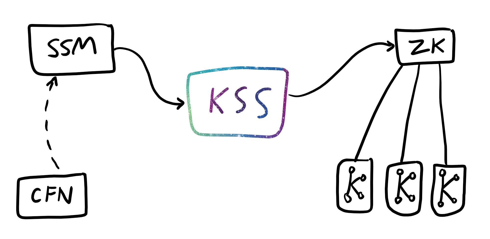

# kafka-ssm-security [](https://travis-ci.org/myob-technology/kafka-ssm-security)



Managing Kafka's Users, ACLs and Topics using AWS SSM Parameter Store and CloudFormation as the source-of-truth.

Running this application will continuously refresh and update the metadata in a Kafka cluster, and overwrite any potential local modifications.

Inspired by the idea behind [kafka-security-manager](https://github.com/simplesteph/kafka-security-manager) but expanded to cover Users and Topics as well.
On top of using a flat-file, it can leverage an external (auditable) source of truth in AWS SSM Parameter Store.

### Usage
Running the application is as simple as running the JAR file or running the container.

### Structure
Since `kss` uses SSM parameters as the source-of-truth for the data, it does
make some assumptions about _where_ to find the data in terms of the hierarchy.

All keys are prefixed with `/kafka-security/$clustername` to isolate which
cluster they relate to for `kss`, so that you can run `kss` to manage _more than
one_ Kafka cluster in the same AWS account.

CloudFormation is not specifically required for `kss` to function, it's just
the example infrastructure-as-code that we used when we were developing
the tool. The main component is the SSM Parameters, which _can_ be done manually.

Technically, Terraform's `aws_ssm_parameter` should also work fine,
though we've not used it ourselves. The main thing that we recommend is that
you *do not store any passwords in plaintext anywhere*; Terraform allows
SecureString params to be declared but __don't do that__.

Parameters are sorted into hierarchies depending on what their values contain:
```bash
/kafka-security/$cluster/topic/$topicname # creating a topic called "$topicname", value is the configuration
/kafka-security/$cluster/users/$username  # creating a user called "$username", value is the ACLs for the user
/kafka-security/$cluster/user-passwords/$username # storing the password for "$username", coupled with the above param
```

#### Topics
Topic records in SSM are straightforward. Create the parameter with the key
being the name of the topic, and the value being some of the key parameters.

To borrow from the CloudFormation example:
```yaml
# The _key_ of a Topic entry is the topic name.
#
# The _value_ of a Topic entry is the configuration info.
#
# The format for the value of a Topic is:
#   ReplicationFactor,Partitions,RetentionHs
#
TestTopic:
  Type: AWS::SSM::Parameter
  Properties:
    Type: String
    Name: /kafka-security/example-cluster/topics/test-topic
    Value: 1,10,24
```
The format for the value of a Topic is: `ReplicationFactor,Partitions,RetentionHs`

That is, a parameter of `/kafka-security/$cluster/topics/$topicname` with value `1,10,24`
will create a topic called `$topicname` with `ReplicationFactor=1, Partitions=10, RetentionHours=24`.

Deleting a topic from the parameter store will _not_ delete the topic data.

#### Users
User records in SSM come in two parts: the User data (with associated ACLs),
and the UserPassword data (an encrypted "SecureString" parameter).

To borrow from the CloudFormation example:
```yaml
# The _key_ of a User entry is their username. Passwords are added to a
# different entry which cannot be set in CloudFormation.
#
# The _value_ of a User entry is their ACL information, one ACL per line.
#
# The format we expect for the ACL entry lines is:
#   ResourceType,PatternType,ResourceName,Operation,PermissionType,FromHost
#
TestUser: # this just names the resource in CloudFormation, to make updates to the stack idempotent.
  Type: AWS::SSM::Parameter
  Properties:
    Name: /kafka-security/example-cluster/users/test-user
    Type: String
    Value: |
      Topic,LITERAL,test-topic,Read,Allow,*,
      Group,LITERAL,test-partition,Write,Allow,*
```

The format we expect for the ACL entry lines is: `ResourceType,PatternType,ResourceName,Operation,PermissionType,FromHost`

Note that in this case, if `kss` is looking for the `example-cluster` name,
it'll create a User (`test-user`) with two ACLs - one for a `Topic`, and one for a `Group`.

More information about the configuration options for ACLs in Kafka is available in the [Confluent documentation](https://docs.confluent.io/current/kafka/authorization.html#using-acls).

Deleting a User parameter from the parameter store will delete the user and revoke their ACLs.

#### Passwords
Note that the User creations require another side parameter, under `user-passwords`, or the user will
not be created.

We expect the passwords for users to be in a different hierarchy:
```
/kafka-security/$cluster/user-passwords/$username
```
The value of this parameter should be a `SecureString` parameter of the plaintext password; SSM will
store the password in an encrypted fashion, but Kafka needs to have access to the plaintext data to
be able to actually create the correct password using the `SCRAM-SHA-256` mechanism.


### Configuration
You can configure two parameters for the actual engine of `kss` with environment variables
- `ZK_ENDPOINT`
  - The Zookeeper connection string.
  - Defaults to `localhost:2181`
- `CLUSTER_NAME`
  - The name of the cluster that `kss` should manage, for finding the correct parameters in SSM.
  - Defaults to `example-cluster`

### Building
Build the container with:
```bash
docker-compose build kss # or: docker build .
```

### Tests

#### Running the fast tests
Run unit tests with:
```bash
docker-compose run unit-tests # or: sbt test
```

#### Running the slower tests
You can run an integration test suite against a miniature Kafka "cluster", by running:
```bash
docker-compose run integration-tests-kafka-only && docker-compose down # to cleanup the 'cluster'
```

#### Running the full integration test suite
There is an extra set of tests that require you to be authenticated to AWS and deploy some actual stacks.

To run the full integration test suite, run:
```bash
script/slow-test.sh
```

You will need to be authenticated, and this will provision a live CloudFormation stack (of SSM Parameters).
After the tests complete, we recommend that you delete this stack from CloudFormation.
